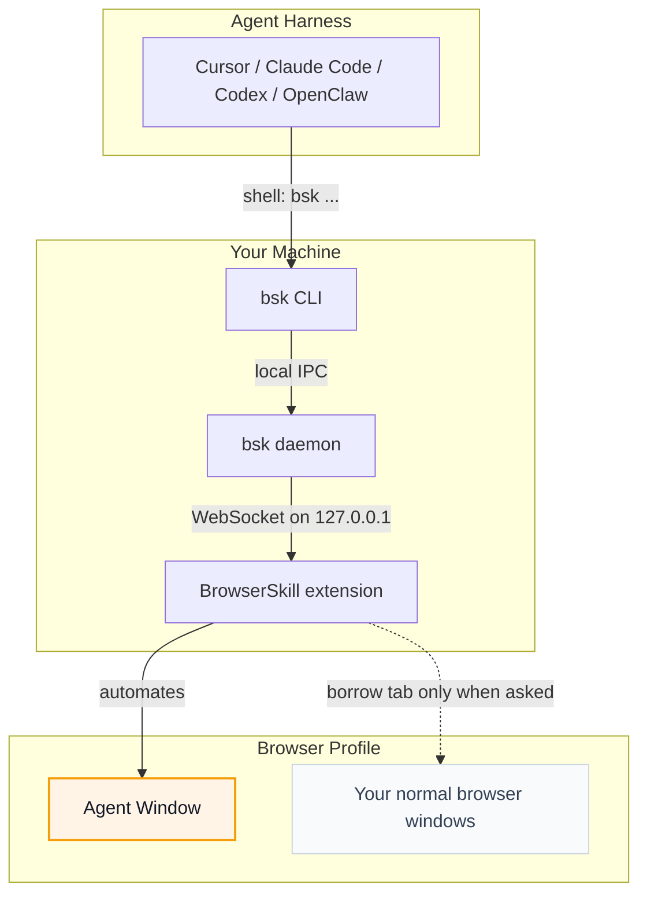

# [Tencent/BrowserSkill](https://github.com/Tencent/BrowserSkill)

# BrowserSkill

<p align="center">
  
</p>

<p align="center">
  <strong>Let AI agents use your browser without interrupting your work.</strong>
</p>

<p align="center">
  English · <a href="README.zh-CN.md">中文</a>
</p>

**BrowserSkill** connects Cursor, Claude Code, Codex, OpenClaw, CodeBuddy,
WorkBuddy, Pi, Hermes Agent, DeepSeek Harness, and other AI agents to your already logged-in
browser.

Need the agent to touch a tab you already have open? It must borrow that tab
explicitly, return it when the task is done, and leave the rest of your browser
alone.

https://github.com/user-attachments/assets/db782c92-b1d4-4aae-a255-039675937a90

## BrowserSkill Advantages

- **Reuse real login state**: Agents can work with sites you are already signed
  into, without separate test accounts.
- **Keep working uninterrupted**: browser tasks run in a separate, visible
  Agent Window, so you can keep using your own browser.
- **Support any Agent**: any Agent that can call a shell can use BrowserSkill
  through the `bsk` CLI, with no lock-in to a specific model, Agent framework, or
  harness.
- **Built-in human-in-loop**: when a task hits captcha, login, confirmation
  dialogs, or other human-only steps, the Agent can ask you to take over and
  then continue afterwards.

Capture a long image in **Quick actions → Full-page screenshot**, or let an Agent use
`bsk screenshot --session <id> --full-page --out page.png`. See the
[full-page screenshot guide](docs/long-screenshot.md) for page support, cancellation and export.

## Runtime Environment

BrowserSkill has two local runtime pieces: the `bsk` CLI/daemon and the browser
extension.

| Runtime | Support |
| --- | --- |
| Operating systems | macOS (Apple Silicon and Intel), Linux (x64 and ARM64), Windows x64 |
| Browsers | Chrome and Microsoft Edge are supported; other Chromium-based browsers are expected to work when they support unpacked Chromium extensions; Firefox is planned |

## Quick Start

Using an agent sandbox that reaps background processes after each command?
Follow the [sandboxed agent setup](docs/sandboxed-agents.md) to keep the daemon
in a persistent host environment and connect with a shared `BSK_HOME` plus
`BSK_AUTO_START=0`. Ordinary local use keeps automatic startup by default.

<details open>
<summary><b>Install with your Agent (recommended)</b></summary>

<br>

Already using Cursor, Claude Code, Codex, or another shell-capable agent? Just
copy this one line and send it to your agent — it will install the CLI and skill
for you, then walk you through loading the extension:

```text
Set up browser-skill on this machine by following https://raw.githubusercontent.com/Tencent/BrowserSkill/main/AGENT_INSTALL.md
```

</details>

<details>
<summary><b>Manual install</b></summary>

<br>

Install the CLI, then install the extension from the [Chrome Web Store](https://chromewebstore.google.com/detail/hhcmgoofomhgciiibhipgmgkgnoenaoi)
or [Edge Add-ons](https://microsoftedge.microsoft.com/addons/detail/browserskill/emacgiaaaiojkkpkddmmdfhmokgmnikg).

#### 1. Install the `bsk` CLI

**macOS / Linux** (recommended — installs to `~/.local/bin`):

```bash
curl -fsSL https://raw.githubusercontent.com/Tencent/BrowserSkill/main/install.sh | sh
export PATH="${BSK_INSTALL_DIR:-$HOME/.local/bin}:$PATH"
```

**Windows** (PowerShell — installs to `~/.local/bin`):

```powershell
irm https://raw.githubusercontent.com/Tencent/BrowserSkill/main/install.ps1 | iex
```

The export makes the CLI available in the current Unix shell. A running agent may
need the same PATH setting in each shell call, or the installed binary's absolute
path. Restart the agent if it retains an old PATH after installation.

Verify the binary in the terminal or agent environment that will use it:

```bash
bsk --version
```

#### 2. Install the browser extension

Install BrowserSkill from your browser's store:

| Browser | Store listing |
| --- | --- |
| Chrome | [Chrome Web Store](https://chromewebstore.google.com/detail/hhcmgoofomhgciiibhipgmgkgnoenaoi) |
| Microsoft Edge | [Edge Add-ons](https://microsoftedge.microsoft.com/addons/detail/browserskill/emacgiaaaiojkkpkddmmdfhmokgmnikg) |

On other Chromium-based browsers, install the Chrome Web Store build.

#### 3. Install the skill

BrowserSkill ships a skill that teaches your agent harness how to use `bsk`. For
these harnesses, install it in one step:

<p align="center">
<table>
  <tr>
    <td align="center" width="108"><a href="https://cursor.com" title="Cursor"></a><br /><sub><b>Cursor</b></sub></td>
    <td align="center" width="108"><a href="https://docs.anthropic.com/en/docs/claude-code" title="Claude Code"></a><br /><sub><b>Claude Code</b></sub></td>
    <td align="center" width="108"><a href="https://developers.openai.com/codex" title="Codex"></a><br /><sub><b>Codex</b></sub></td>
    <td align="center" width="108"><a href="https://openclaw.ai" title="OpenClaw"></a><br /><sub><b>OpenClaw</b></sub></td>
    <td align="center" width="108"><a href="https://www.codebuddy.ai" title="CodeBuddy"></a><br /><sub><b>CodeBuddy</b></sub></td>
    <td align="center" width="108"><a href="https://www.workbuddy.ai" title="WorkBuddy"></a><br /><sub><b>WorkBuddy</b></sub></td>
    <td align="center" width="108"><a href="https://github.com/badlogic/pi-mono" title="Pi"></a><br /><sub><b>Pi</b></sub></td>
    <td align="center" width="108"><a href="https://github.com/NousResearch/hermes-agent" title="Hermes Agent"></a><br /><sub><b>Hermes Agent</b></sub></td>
  </tr>
</table>
</p>

```bash
bsk install-skill
```

Use <kbd>Space</kbd> to select the Agent harness you want to install into, then
press <kbd>Enter</kbd> to install the skill. Run `bsk install-skill --list` to see
internal variants and install paths.

For non-interactive installation, specify the intended harness, for example
`bsk install-skill --harness cursor --json`. Explicit selection also works when
the harness is not detected. `--yes` alone installs into every detected harness
and fails when none are detected.

To install your own instructions, use `bsk install-skill --harness cursor --source ./SKILL.md`.
An explicit `--source` stays custom even if its contents match the bundled skill.
Existing installations are skipped unless you add `--force`.

Daemon startup, `session start`, and `doctor` automatically update managed skills
only when their contents still match the last installed version. Local edits are
preserved and automatic updates pause. An older installation without a content
baseline is enrolled automatically only if it exactly matches the current bundled
skill; this writes the source marker without rewriting `SKILL.md`. Explicit custom
installations stay custom even when their contents match.

For differing historical files, local edits, or an unrecognized source marker,
`doctor` shows `WARN` with the reason and recovery options. These warnings do not
make the health check fail (`--json` reports `status: "warn"` and `ok: true`).
A concurrent install or sync is reported as deferred and retried on a later pass.

To keep your current instructions as an explicit customization, run
`bsk install-skill --harness cursor --source <existing-SKILL.md> --force`, replacing
`<existing-SKILL.md>` with the path to your existing file. To restore the bundled
skill and resume automatic updates, run `bsk install-skill --harness cursor --force`
without `--source`. This second command overwrites the existing instructions.

Other shell-capable agent harnesses are supported too. Copy
[`skill/SKILL.md`](skill/SKILL.md) into your harness's skills directory as
`browser-skill/SKILL.md` to install the skill manually. DeepSeek Harness uses a
dedicated plugin instead — see [DeepSeek Harness plugin](#deepseek-harness-plugin).

#### 4. Verify the connection

Run `bsk doctor` and follow its hints. Open the extension popup and confirm it is
connected. Explain any warnings and resolve failures before testing browser use.
Doctor can pass with no skill installed (`N/A`); verify skill discovery separately.

</details>

Start a new Agent session, confirm `browser-skill` is available in the harness,
and ask it to open `https://example.com` and summarize the page. For harnesses
with slash-command skill invocation, for example:

```text
/browser-skill open example.com and summarize what is on the page.
```

A successful first-use check reads the page and stops its BrowserSkill session.
If the skill is missing, check the target harness and install path before retrying.

### Updating

For the default local setup, finish active browser tasks before updating:

```sh
bsk update --yes
```

If Windows reports a staged update, wait for the replacement to finish before
checking `bsk --version`.

When it installs an update, this command restarts a running daemon with default
startup settings. If you replaced the binary using the installer instead, restart
the existing daemon with `bsk daemon restart` after tasks finish.

For a custom port, host-managed sandbox daemon, or remote server, stop the daemon
in its owning host or supervisor, run `bsk update --yes --no-restart-daemon`, and
start it there with its original flags and `BSK_HOME`. Set `BSK_AUTO_START=0`
in agent commands while managing it; see the [sandbox](docs/sandboxed-agents.md)
and [remote](docs/remote-extension-connection.md) setup guides.

Update the extension through its browser store; for an unpacked development build,
rebuild and reload it. Store availability may lag the CLI release. Check the CLI,
daemon and extension versions with `bsk --version` and `bsk status`, then run
`bsk doctor`. New features such as full-page screenshots need matching builds.
Update the [DSH plugin separately](#deepseek-harness-plugin) and restart its profile.
Managed CLI skills synchronize on daemon startup, `session start`, or `doctor`;
local edits and custom skills are preserved. Start a new agent session to load
updated instructions.

**Upgrading to 0.3.0:** `--unattended`, `tab borrow --no-confirm`, and
`BSK_REQUEST_HELP=off` no longer bypass confirmation or disable help. Choose the
corresponding extension settings described below. See [what changed](CHANGELOG.md).

### Automation settings

The extension popup has two independent **Automation settings**, both enabled by default.
The user's saved browser settings are authoritative for every session:

| Confirm before borrowing tabs | Allow requests for human help | Behavior |
| --- | --- | --- |
| On | On | Borrowing requires approval; help requests show the existing UI. |
| On | Off | Borrowing requires approval; help requests return `disabled`. |
| Off | On | Borrowing skips confirmation; help requests show the existing UI. |
| Off | Off | Borrowing skips confirmation; help requests return `disabled`. |

Settings save automatically for the browser profile and apply to existing and new sessions.
Turning confirmation off releases pending borrow confirmations; turning help off finishes pending
help requests as `disabled`. Turning either back on restores its behavior for subsequent operations,
including sessions created with the legacy `--unattended` flag. Completed borrows are not undone,
and finished help requests are not reopened. Allowing help makes `request-help` available; it does
not require every browser action to ask for permission. Task authorization and host approvals still apply.

Start tasks with `bsk session start`; add `--no-focus` to avoid focusing the Agent Window.
For unattended operation, turn off the corresponding settings in the extension. `--unattended`,
`tab borrow --no-confirm`, and `BSK_REQUEST_HELP=off` remain accepted for compatibility but are
deprecated and cannot override the switches. The CLI logs a notice when these inputs are used;
the daemon also logs a notice for its inherited environment setting. Scripts that relied on these
inputs alone to avoid waiting must now use the browser settings. `session start --json` and
`session list --json` report the browser's effective `interaction` policy.

When help is disabled, `request-help` returns `disabled` without confirming any human action.
The skill directs the agent to re-observe and make reasonable efforts to complete authorized steps
using existing login state, authorized inputs, and available tools. Where task authorization and
host rules allow, models with image understanding may attempt graphical verification. Phone-only
QR scans, face verification, unavailable SMS codes, and image-only CAPTCHAs for text-only models
may remain blocked. A disabled result neither completes the task nor grants additional permission.

If preference loading fails, the runtime retains known values or defaults to both enabled when no
valid value is available. It does not write fallback defaults or block session creation. Later reads
and storage events can recover the settings. The popup reports read failures and prevents saving;
failed writes are not treated as successful. A disconnected browser produces an error, not a local
`disabled` result based on command-line flags or environment variables.

`tab borrow --timeout 60s` controls the confirmation wait, not whether confirmation is required.
Protocol 1.3 retains connection compatibility with protocols 1.0–1.2. Ordinary sessions and
default tab borrowing remain available during staggered upgrades. The popup identifies older
daemons, while `bsk status` reports protocol differences. Custom borrowing waits require both
daemon and extension protocol 1.2 or later; only that operation returns an upgrade error when
unsupported. Older daemons may still have shorter default borrowing waits.

The current CLI requires daemon protocol 1.3 for `request-help`, because older daemons can answer
locally without consulting the browser. This restriction does not disconnect the browser or stop
other operations. Update the CLI, running daemon, and extension for full enforcement of the
settings above. New extensions always enforce their saved settings on requests they receive.
An older CLI may exit locally for `BSK_REQUEST_HELP=off` before contacting the daemon; mixed-version
installations retain such legacy behavior, which updating only the extension cannot change.

Run an Agent on a server and pair it with your local browser using the built-in authentication service, or a compatible gateway. See [remote browser connections](docs/remote-extension-connection.md).

## DeepSeek Harness plugin

Using [DeepSeek Harness](https://github.com/deepseek-ai/deepseek-harness) (`dsh`)?
BrowserSkill ships a first-class dsh plugin on npm as
[`@wxg-prc-cpg/browser-skill-dsh-plugin`](https://www.npmjs.com/package/@wxg-prc-cpg/browser-skill-dsh-plugin).
It gives the agent native `browser_*` tools and a live view of its browser sessions
in the Web UI. The plugin runs `bsk` on the agent's behalf.

Install the `bsk` CLI and connect the browser extension first. Then add the plugin
to a dsh profile and start it (replace `web` with your profile name):

```sh
dsh plugin --profile web add @wxg-prc-cpg/browser-skill-dsh-plugin
dsh --profile web
```

The plugin includes the `browser-skill` skill, so `bsk install-skill` is not needed
for dsh. Installed plugins do not update automatically. To upgrade this plugin:

```sh
dsh plugin --profile web update @wxg-prc-cpg/browser-skill-dsh-plugin --latest
```

Restart the profile after upgrading. See the
[plugin README](packages/dsh-plugin-browserskill/README.md) for usage and configuration.

## How It Works

BrowserSkill is a local bridge between your agent harness and your browser.



The agent never talks to the browser directly. It asks the `bsk` CLI to perform a
browser task; the local daemon routes that request to the extension; the
extension runs it in an Agent Window. DeepSeek Harness takes the same path
through the [plugin](#deepseek-harness-plugin): the agent calls injected
`browser_*` tools, and the plugin invokes `bsk` on its behalf.

## For Developers

The [scroll-to primitive reference](docs/scroll-to.md) covers its CLI, protocol
and plugin entry points, visible bounds and interruption behavior.

The repository is a Cargo + pnpm workspace:

- `crates/bsk-cli` — `bsk` CLI and local daemon
- `crates/bsk-protocol` — shared wire types and JSON schemas
- `apps/extension` — browser extension
- `packages/ui` and [`packages/i18n`](packages/i18n/README.md) — shared extension UI support, including English, Simplified Chinese and Korean localization
- `packages/dsh-plugin-browserskill` — DeepSeek Harness plugin (`@wxg-prc-cpg/browser-skill-dsh-plugin`)
- [`evals/browser`](evals/browser/README.md) — deterministic local pages and agent-neutral browser capability evaluation

## License

MIT
