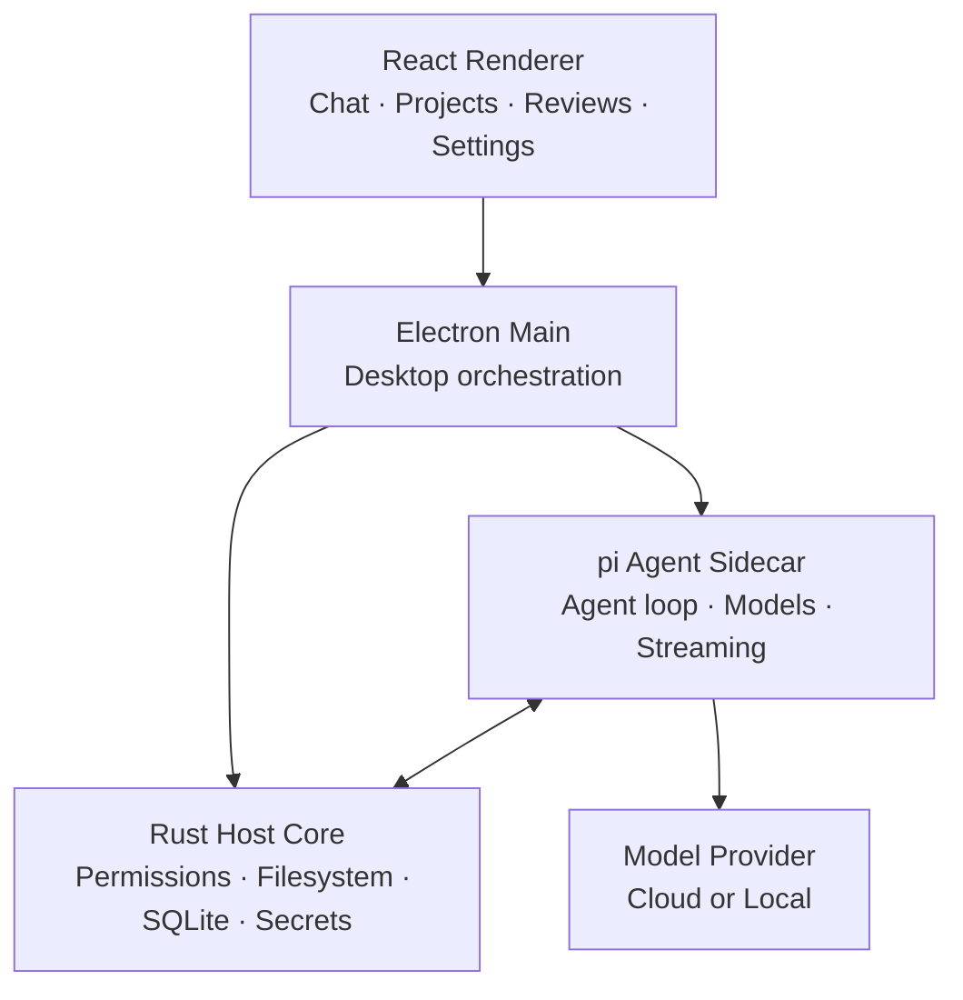

# [vastsa/PI-Desktop](https://github.com/vastsa/PI-Desktop)

<div align="center">


# PI-Desktop

### Your local-first desktop workspace for AI coding agents.

**Bring your own model. Open any local project. Let agents work — while you stay in control.**

No PI-Desktop account. No mandatory relay. No editor lock-in.

<br />

[](https://github.com/vastsa/PI-Desktop/releases/latest)
[](https://github.com/vastsa/PI-Desktop/releases)
[](https://github.com/vastsa/PI-Desktop/stargazers)
[](https://github.com/vastsa/PI-Desktop/actions/workflows/ci.yml)
[](LICENSE)


<a href="https://trendshift.io/repositories/178787?utm_source=repository-badge&amp;utm_medium=badge&amp;utm_campaign=badge-repository-178787" target="_blank" rel="noopener noreferrer"></a>
<a href="https://www.producthunt.com/products/pi-desktop?embed=true&amp;utm_source=badge-featured&amp;utm_medium=badge&amp;utm_campaign=badge-pi-desktop" target="_blank" rel="noopener noreferrer"></a>

**[Download PI-Desktop](https://github.com/vastsa/PI-Desktop/releases/latest)** ·
[Documentation](https://pi-docs.aiuo.net/) ·
[Screenshots](docs/guide/screenshots.md) ·
[简体中文](README.zh-CN.md)

<br />


<sub>A standalone desktop workspace for coding agents, projects, models, tools, and long-running sessions.</sub>

</div>

---

> [!IMPORTANT]
> **PI-Desktop is currently in Early Preview.**
>
> The project is actively developed and already usable for real coding workflows, but APIs, extension interfaces, and some desktop behaviors may continue to evolve.

## Why PI-Desktop?

Most coding agents live inside a terminal, an editor extension, or a hosted service.

PI-Desktop gives them a workspace of their own.

<table>
<tr>
<td width="50%" valign="top">

### 🖥️ Desktop-first

Work across repositories and sessions without tying your agent workflow to one editor or terminal.

Projects, conversations, reviews, files, previews, notifications, and extensions live in one workspace.

</td>
<td width="50%" valign="top">

### ✨ Bring your own model

Use OpenAI, Anthropic, local models, hosted gateways, or any OpenAI-compatible API.

Configure multiple providers and models, then switch between them per session.

</td>
</tr>

<tr>
<td width="50%" valign="top">

### 🔍 Inspectable by default

Agents can read files, edit code, and run commands — but privileged actions pass through PI-Desktop's permission layer.

Review diffs, inspect command output, and decide how much autonomy each session gets.

</td>
<td width="50%" valign="top">

### 🧩 Built to extend

Add Skills, MCP servers, Subagents, and installable Plugins.

Plugins can contribute tools, commands, panels, themes, services, skills, and new workspace experiences.

</td>
</tr>
</table>

---

## From prompt to patch

Getting started only takes a few steps:

1. **Connect a model**
   Open **Settings → Model configuration**, choose a provider or compatible API, and add your credentials.

2. **Open a project**
   Add any local repository or project directory from the sidebar.

3. **Pick Agent, Plan, or Goal**
   **Agent** starts working. **Plan** waits until you approve a frozen implementation plan. **Goal** waits until you approve the outcome, then the agent chooses the path.

4. **Review the result**
   Inspect edits in the Review panel, check command output, preview the application, and continue the conversation without leaving PI-Desktop.

---

## More than a chat window

### Agent, Plan, and Goal

Same agent. Three gates. Privileged tools still go through the permission layer in every mode.

| | **Agent** | **Plan** | **Goal** |
| --- | --- | --- | --- |
| You approve | Nothing extra | The implementation plan | The outcome and acceptance criteria |
| The agent does | Reads, edits, runs commands, tests, iterates | Studies the repo, writes a frozen plan, then waits | Picks the path and works until the goal is met |
| Use when | You want it to just do the work | The change is large or risky and you want the approach first | You care about the result, not the route |

**Agent** is the default loop: inspect the tree, patch files, run commands, and keep going.

**Plan** is the approval boundary. The agent researches first and produces an immutable implementation plan. Execution does not start until you sign off.

**Goal** is outcome-first. You lock the objective and acceptance criteria; the agent decides how to get there.

---

### Delegate work to Subagents

Large tasks rarely belong in one context window.

PI-Desktop can delegate independent work to background Subagents for things like:

* codebase exploration
* multi-file implementation
* research and investigation
* test analysis
* adversarial review

Each Subagent runs in its own context and reports its result back to the parent agent.

---

### A workspace built for long sessions

PI-Desktop is designed for more than one prompt at a time.

You can manage multiple projects and sessions, pin or archive conversations, branch sessions, queue prompts while an agent is running, reference files with `@`, use slash commands, and search across the application.

Streaming responses are checkpointed so interrupted work can survive application restarts or runtime failures whenever possible.

---

## Your models, your choice

PI-Desktop does not lock the agent runtime to a hardcoded model list.

Use:

* OpenAI and Anthropic
* OpenAI-compatible APIs
* hosted model gateways
* local gateways such as Ollama and LM Studio
* multiple models under the same provider
* provider OAuth accounts where supported

Model configuration can include context windows, output limits, reasoning controls, temperature, and other model-specific behavior.

Switch models directly from the Composer without recreating your session.

---

## Review the work, not just the answer

The agent workspace includes dedicated surfaces for the things that matter while coding:

<table>
<tr>
<td width="50%">


<p align="center"><sub>Long-running conversations with transcript navigation</sub></p>

</td>
<td width="50%">


<p align="center"><sub>Switch providers, models, and reasoning levels per session</sub></p>

</td>
</tr>
<tr>
<td width="50%">


<p align="center"><sub>Extend the workspace through the plugin marketplace</sub></p>

</td>
<td width="50%">


<p align="center"><sub>Add a provider and connect a model</sub></p>

</td>
</tr>
</table>

<p align="center">
<a href="docs/guide/screenshots.md"><strong>Explore all screenshots →</strong></a>
</p>

---

## Extensions without rebuilding the app

PI-Desktop has several extension layers depending on how deeply you want to customize the agent.

### Skills

Give agents reusable instructions and workflows.

Skills can be installed globally or activated for individual projects.

### MCP

Connect external tools and services through Model Context Protocol servers without baking them into the desktop application.

PI-Desktop can also be controlled by an external MCP Agent. Start the app with
`PI_DESKTOP_MCP_CONTROL=1`; then read the loopback endpoint and bearer token
from `mcp-control.json` in the Electron user-data directory. The endpoint
supports project/session/Agent workflows and a reviewed desktop operation
catalog. It is disabled by default, binds loopback only, and grants the
calling local Agent the same authority as the desktop for those operations —
`confirm: true` is not a user prompt.

### Subagents

Create specialized agents with their own instructions, tools, and model choices, then delegate work to them from another agent.

### pi extensions

Extensions written for the [pi](https://github.com/badlogic/pi-mono) CLI run
inside PI-Desktop's agent unchanged: a plugin lists them under
`contributes.agentExtensions`, and Plugins → "Import pi extension" wraps an
existing extension file or directory in a plugin for you. They register
tools, slash commands, and hooks on every turn, tool call, and provider
request, and run with the same access as the agent's own tools, which the
`agent.extension` permission asks you to confirm.

### Plugins

Plugins can extend PI-Desktop itself with:

* agent tools
* commands
* workspace panels
* work-panel views
* Skills
* MCP servers
* Subagents
* themes
* resident services
* inter-plugin messaging

Plugins can be installed locally or through the marketplace using the `.piplug` package workflow.

> [!NOTE]
> Plugin processes are permission-gated and isolated from the renderer, but plugins are still user-trusted code rather than a complete operating-system sandbox. Only install plugins you trust.

[Build your first plugin →](docs/plugin-development.md)

---

## Local-first, precisely

PI-Desktop is **local-first**, not “nothing ever touches the network.”

| Data                 | Behavior                                                |
| -------------------- | ------------------------------------------------------- |
| Conversations        | Stored locally as JSONL with a SQLite index             |
| Settings             | Stored on your machine                                  |
| API credentials      | Stored in the operating system keychain                 |
| Logs                 | Local                                                   |
| PI-Desktop telemetry | None                                                    |
| Model requests       | Sent directly to the provider or endpoint you configure |

There is no required PI-Desktop account and no mandatory PI-hosted relay between your machine and your model provider.

If you use a remote model provider, the context required for that model request is naturally sent to that provider according to its own privacy policy.

---

## Download

Download the latest build from **[GitHub Releases](https://github.com/vastsa/PI-Desktop/releases/latest)**.

| Platform | Architecture  | Package              |
| -------- | ------------- | -------------------- |
| macOS    | Apple Silicon | `.dmg` / `.zip`      |
| macOS    | Intel         | `.dmg` / `.zip`      |
| Windows  | x64           | NSIS installer / portable exe |
| Linux    | x64           | `.AppImage` / `.deb` / `.rpm` / `.asar` |

Packaged builds can check GitHub Releases for updates and surface new versions inside the application. Windows NSIS and Linux AppImage can download and install in-app; macOS, Linux deb/rpm, and the Windows portable exe open the releases page. The Linux `.asar` asset is available for repackaging with a system Electron; launch it with `electron PI-Desktop-<version>-linux-x64.asar` after adding the native host and packaged resources required by the target distribution.

### Linux

Linux x64 packages need **glibc 2.35** or newer. That is the library shipped with:

* Ubuntu 22.04 or later
* Debian 12 or later
* Fedora 36 or later

Ubuntu 20.04, Debian 11, Fedora 35, and older releases cannot load the bundled host. Check with `ldd --version`.

### macOS

The tagged-release workflow publishes unsigned macOS artifacts by default. For
a trusted unsigned install, move `PI-Desktop.app` to Applications and
double-click `PI-Desktop-macOS-open.command` if macOS says the app is damaged.
A manually dispatched run with `sign_macos: true` signs, notarizes, and staples
macOS artifacts with Developer ID credentials before publication; signed builds
do not need the helper.

---

## Import your existing sessions

Already using another coding agent?

PI-Desktop can import local sessions from supported tools including:

* Claude Code
* Codex
* OpenCode
* Pi

Open **Settings → Import** to bring existing work into the desktop workspace.

---

## Architecture

PI-Desktop deliberately separates the user interface from privileged host capabilities and the agent loop.



The renderer has no Node integration.

The **Rust Host Core** owns privileged workspace operations, permissions, persistence, and secrets. The **pi Agent Sidecar** owns model interaction and the agent loop. Electron coordinates the desktop lifecycle while keeping those responsibilities separated.

[Read the architecture specification →](docs/spec/02-architecture/01-architecture.md)

---

## Project status

PI-Desktop is an early preview under active development.

The current **0.14.x** line includes the desktop shell, streaming agent runtime, Agent / Plan / Goal workflows, permission-aware workspace tools, projects and sessions, session imports, local MCP control, MCP / Skills / Subagents, background delegation, multi-provider model configuration, plugins and marketplace support, context checkpoints, notifications, release notes, and cross-platform packaging.

Current priorities include:

* macOS tagged-release qualification
* installer upgrade and rollback qualification
* continued runtime and session-recovery hardening
* stronger plugin sandboxing and publisher verification
* broader UI-driven end-to-end coverage

Follow development through the [project board](docs/project/BOARD.md) and [milestones](docs/spec/06-delivery/01-mvp-milestones.md).

---

## Development

### Requirements

* Node.js `>=22.19`
* pnpm `>=10`
* stable Rust toolchain

The repository currently pins pnpm 11, while CI and release builds use Node 24.

### Run locally

```bash
git clone https://github.com/vastsa/PI-Desktop.git
cd PI-Desktop

pnpm install

cargo build -p host-core
pnpm build:js

pnpm dev
```

### Validate changes

```bash
pnpm typecheck
pnpm lint
pnpm test
```

Additional protocol, Plan, supervision, Subagent, and Electron E2E suites are documented in the repository specification.

### Documentation

```bash
pnpm docs:dev
pnpm docs:check
```

Useful references:

* [Documentation](https://pi-docs.aiuo.net/)
* [Specification index](docs/spec/README.md)
* [Architecture](docs/spec/02-architecture/01-architecture.md)
* [Product scope](docs/spec/01-product/01-product-scope.md)
* [Plugin development](docs/plugin-development.md)
* [E2E test plan](docs/spec/06-delivery/04-e2e-test-plan.md)
* [Release runbook](docs/spec/06-delivery/06-release-runbook.md)
* [Repository agent guide](AGENTS.md)

---

## Contributing

Issues, bug reports, feature proposals, documentation improvements, and pull requests are welcome.

For larger changes, opening an issue first makes it easier to align the implementation with the existing architecture and product contracts.

When working in the repository, start with [AGENTS.md](AGENTS.md) and the [specification index](docs/spec/README.md).

[Report an issue](https://github.com/vastsa/PI-Desktop/issues/new/choose) ·
[View open issues](https://github.com/vastsa/PI-Desktop/issues)

---

## Built on open source

PI-Desktop builds on the excellent work of the open-source ecosystem.

The agent runtime uses [`pi-ai`](https://github.com/badlogic/pi-mono) and `pi-agent-core` from **pi-mono**.

The desktop application is built with technologies including Electron, React, TypeScript, Rust, SQLite, Vite, Tailwind CSS, Shiki, Mermaid, KaTeX, TypeBox, and i18next.

Thank you to every project and contributor that makes PI-Desktop possible.

---

## Model acknowledgements

This project was created by the models below — not by a lone genius, but by a token-powered construction crew.

| Provider | Model | Tokens |
| --- | --- | ---: |
| OpenAI | `gpt-5.6-luna` | 5,304,019,817 |
| OpenAI | `gpt-5.6-sol` | 4,825,458,273 |
| OpenAI | `gpt-5.4` | 4,213,269,324 |
| Anthropic | `claude-opus-5` | 3,909,952,653 |
| OpenAI | `gpt-5.5` | 3,800,382,171 |
| xAI | `grok-4.5` | 1,947,736,115 |
| xAI | `grok-4.6` | 797,233,571 |
| DeepSeek | `deepseek-v4-flash` | 329,790,234 |
| OpenAI | `gpt-5.2-codex` | 320,983,170 |
| Xiaomi | `mimo-v2.5-pro` | 304,822,052 |
| Anthropic | `claude-fable-5-1` | 302,580,552 |
| OpenAI | `gpt-5.6-terra` | 274,107,085 |
| OpenAI | `gpt-5.3-codex` | 255,366,945 |
| OpenAI | `gpt-5.1-codex-max` | 220,947,212 |
| OpenAI | `gpt-5.1` | 142,533,699 |
| — | `Unknown model` | 69,801,632 |
| Anthropic | `claude-opus-4.6` | 55,223,768 |
| Zhipu | `stealth/ox-alpha` | 22,954,876 |
| Anthropic | `claude-fable-5` | 16,116,907 |
| OpenAI | `gpt-5.1-codex-mini` | 12,895,478 |
| Xiaohongshu | `dots-3-note-prev` | 10,166,895 |
| OpenAI | `gpt-5.1-codex` | 3,916,509 |
| Xiaomi | `mimo-v2.5` | 3,785,071 |

**Total for listed models:** 27,144,044,009 tokens.

---

## Community Links

- [Linux.Do](https://linux.do/) — A community for sharing and discussing technology.

## License

PI-Desktop is licensed under the **GNU Lesser General Public License v3.0**.

See [LICENSE](LICENSE) for details.

---

<div align="center">

### Build with the model you want. Keep the workflow yours.

**[Download PI-Desktop](https://github.com/vastsa/PI-Desktop/releases/latest)**

<sub>macOS · Windows · Linux</sub>

</div>

---

## Code Signing

Windows releases of PI-Desktop are digitally signed with free code signing
provided by [SignPath.io](https://signpath.io/), using a certificate from the
[SignPath Foundation](https://signpath.org/).
